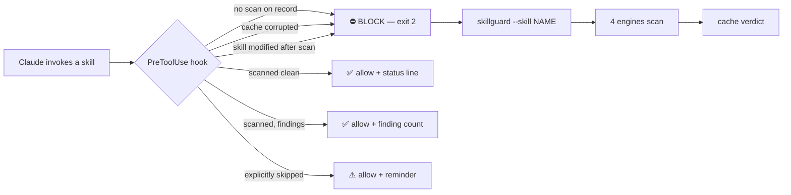

<div align="center">

# 🛡️ SkillGuard

**Scan Claude Code skills for malicious code — before Claude runs them.**

*Four detection engines — zero-dep local patterns, Cisco, Snyk, SkillAudit — orchestrated behind a PreToolUse hook that blocks anything unscanned. Prompt injection, credential theft, reverse shells, data exfiltration: caught at the gate.*

[](https://github.com/mannanj/skillguard/actions/workflows/ci.yml)
[](LICENSE)
[](pyproject.toml)


</div>

---

## Why

Community skills are an unaudited supply chain running with your permissions. When researchers audited ClawHub (the OpenClaw skill marketplace) in early 2026, [Koi Security found 341 malicious skills](https://www.koi.ai/blog/clawhavoc-341-malicious-clawedbot-skills-found-by-the-bot-they-were-targeting) — typosquatted lookalikes whose "Prerequisites" step installed an infostealer that harvested crypto wallets, SSH keys, and `.env` files. [Snyk's follow-up study](https://snyk.io/blog/toxicskills-malicious-ai-agent-skills-clawhub/) found that **13.4% of all skills on the registry contained at least one critical-level security issue**. Claude Code skills share the same trust model: a `SKILL.md` you probably never read, executing with everything you've allowed.

Every existing scanner checks skills *when you remember to run it*. SkillGuard is the one that also **blocks at runtime**: a PreToolUse hook that refuses to let Claude use any skill that hasn't been scanned.

## Quick start

```bash
# Inside Claude Code — hook auto-registers, no settings.json editing:
/plugin marketplace add mannanj/skillguard
/plugin install skillguard@skillguard
```

Then scan everything once:

```bash
skillguard --engines local        # instant, zero dependencies
```

From now on, every skill invocation shows a one-line verdict — and unscanned skills are blocked until you scan (or explicitly skip) them.

## Install

| Method | Command | Notes |
|---|---|---|
| **Claude Code plugin** (recommended) | `/plugin marketplace add mannanj/skillguard` then `/plugin install skillguard@skillguard` | Hook auto-registers on enable |
| pip / pipx | `pip install -e .` from a clone | `skillguard` + `skillguard-hook` entry points |
| curl installer | `curl -fsSL https://raw.githubusercontent.com/mannanj/skillguard/main/install.sh \| sh` | Copies files + patches `settings.json` (backed up first) — [read it](install.sh) before piping |
| Manual | clone + add [examples/settings-hook-snippet.json](examples/settings-hook-snippet.json) to `~/.claude/settings.json` | Full control |

Optional engines: `pip install "skillguard[cisco]"` for the Cisco engine; set `SNYK_TOKEN` (+ [uv](https://docs.astral.sh/uv/)) for Snyk; SkillAudit needs nothing but network.

## How it works



The scanner walks every `.md/.py/.sh/.js/.ts/.yaml/.json` file in each skill, runs the selected engines, and caches the verdict at `~/.claude/skillguard-cache/`. The hook reads that cache in milliseconds at invocation time.

## Detection engines

| Engine | What it brings | Requires |
|---|---|---|
| **local** | 50+ compiled regex patterns, 13 threat categories. Deterministic, offline, instant. | Nothing — stdlib only |
| **cisco** | [Cisco AI Skill Scanner](https://github.com/cisco-ai-defense/skill-scanner): YARA + YAML rules, AST behavioral analysis | `pip install "skillguard[cisco]"` |
| **skillaudit** | [SkillAudit](https://skillaudit.vercel.app) REST API: 401 patterns, cross-file analysis | Network |
| **snyk** | [Snyk agent-scan](https://github.com/snyk/agent-scan): LLM-powered semantic detection | `SNYK_TOKEN` + [uv](https://docs.astral.sh/uv/) |

```bash
skillguard --engines all                 # everything available
skillguard --engines local,skillaudit    # pick your mix
```

Engines degrade gracefully — a missing dependency skips that engine with a note, never a crash.

## What it catches

| Category | Severity | Examples |
|---|---|---|
| Reverse shells | critical | `/dev/tcp/`, `nc -e`, socat exec, named-pipe shells |
| Data exfiltration | critical | webhook.site, requestbin, ngrok, Burp Collaborator endpoints |
| Prompt injection | high | "ignore all previous instructions", role reassignment, system-prompt override |
| Credential theft | high | `~/.ssh/id_rsa`, `~/.aws/credentials`, keychain, wallet/seed-phrase access |
| Env-var exfiltration | high | `env \| curl`, piping `$*KEY*`/`$*SECRET*`/`$*TOKEN*` |
| Piped execution | high | `curl … \| sh`, `wget … \| bash` |
| Obfuscation | high | base64-decode-exec, hex/unicode escapes, zero-width characters |
| Persistence | medium | crontab, LaunchAgents, systemd, shell-profile edits |
| Container escape | medium | docker.sock, nsenter, LD_PRELOAD |
| Recon, network ops, dangerous file ops | medium/low | nmap, tcpdump, `rm -rf /`, fork bombs, `whoami`/`uname` |

## Output

```
SkillGuard Scan Results — 2026-06-03 16:20:11 UTC
============================================================
Engines: local
Scope:   global (42 skills), local (3 skills)

SUMMARY
  SEVERITY       LOCAL     TOTAL
  ──────────────────────────────
  critical           2         2
  high               5         5
  medium             1         1

FINDINGS (HIGH+)
  CRITICAL  pretty-formatter (global) — [local] Reverse shell via /dev/tcp
           scripts/setup.sh:14
  HIGH      pretty-formatter (global) — [local] curl piped to shell execution
           SKILL.md:23
```

Formats: `--format table` (default, colored), `--format json`, `--format markdown`, `--quiet`.

## Exit codes

| Code | CLI | Hook |
|---|---|---|
| 0 | scan completed (findings or not) | **allow** — status line on stdout |
| 1 | usage error / no skills found / no engines | — |
| 2 | — | **block** — unscanned, corrupted cache, or modified-since-scan |

## Configuration

| Variable | Default | Purpose |
|---|---|---|
| `SKILLGUARD_SKILLAUDIT_BASE` | `https://skillaudit.vercel.app` | SkillAudit endpoint override |
| `SKILLGUARD_SKILLAUDIT_DELAY` | `2.1` | Seconds between SkillAudit calls (30 req/min limit) |
| `SNYK_TOKEN` | — | Enables the Snyk engine |

To stop the hook blocking a skill you've decided to trust without scanning: `skillguard --skip NAME` — it allows the skill but shows a reminder on every use. (A proper allowlist/baseline file is on the [roadmap](CHANGELOG.md).)

## Security considerations

SkillGuard audits its own attack surface — see [SECURITY.md](SECURITY.md) for the full threat model and private disclosure process. The short version:

- The hook **fails closed**: missing, corrupted, or unreadable cache → block, never silent allow.
- **TOCTOU guard**: a skill modified after its last scan is blocked until re-scanned. *Known limitation: only enforced for skills in `~/.claude/skills/`; plugin-namespaced skills aren't yet located for the mtime check.*
- The scanner never executes skill code — it only reads files.
- An attacker with arbitrary write access to your home directory is out of scope (they could remove the hook itself).

## False positives

Pattern scanning flags *appearances*, and security documentation legitimately contains attack strings. The local engine suppresses comment lines explaining detections and markdown table rows, but expect occasional flags on security-related skills — that's the trade for catching real ones. Findings show exact `file:line` context so you can judge in seconds. If a pattern fires wrongly on something common, [open an issue](https://github.com/mannanj/skillguard/issues) with the sample.

## Contributing

The highest-value contribution is a **new detection pattern with a malicious fixture and a false-positive guard test** — see [CONTRIBUTING.md](CONTRIBUTING.md). Engine adapters, hook hardening, and docs welcome too.

## Related projects

[Cisco AI Skill Scanner](https://github.com/cisco-ai-defense/skill-scanner) · [Snyk agent-scan](https://github.com/snyk/agent-scan) · [SkillAudit](https://skillaudit.vercel.app) · [claude-skill-antivirus](https://github.com/claude-world/claude-skill-antivirus) · [skillcop](https://github.com/cfitzgerald-pd/skillcop) — all excellent scanners. SkillGuard's difference: it orchestrates them *and* enforces at runtime.

## License

[Apache-2.0](LICENSE)
